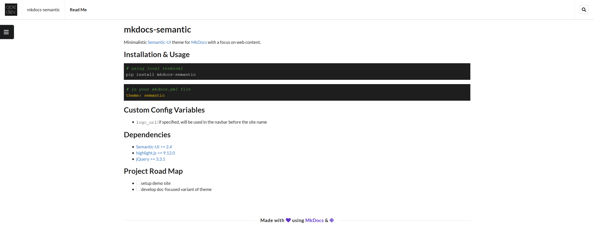

# mkdocs-semantic

Minimalistic [Semantic-UI](https://semantic-ui.com/) theme for [MkDocs](https://www.mkdocs.org/) with a focus on web content.


## Example

[](img/mkdocs-semantic.png)

<br/>

## Installation & Usage

```python
# using local terminal
pip install mkdocs-semantic
```

```yml
# in your mkdocs.yml file
theme: semantic
```
<br/>

## Configuration

Theme customizations options

### Logo

The default logo is the Python icon from Semantic-UI, however it can be overidden using an image or an icon.

To use an image, specify the URL or relative path to the image:

```yaml
theme:
  logo:
    image: 'images/logo.png'
```

To use an icon, specify the name of a [Semantic-UI icon](https://semantic-ui.com/elements/icon.html):

```yaml
theme:
  logo:
    icon: 'python'
```

### Breadcrumbs

The breadcrumbs are enabled by default, but can be disabled through the breadcrumb variable:

```yaml
theme:
  breadcrumb: false
```

### Sidebar

The sidebar is enabled by default, but can be disabled through the sidebar variable:

```yaml
theme:
  sidebar: false
```

### Search

The search functionality is enabled by default (adding a search icon to the navbar), but can be disabled through the search variable:

```yaml
theme:
  search: false
```

<br/>

## Dependencies

- [Semantic-UI >= 2.4](https://semantic-ui.com/)
- [highlight.js >= 9.12.0](https://highlightjs.org/)
- [jQuery >= 3.3.1](https://jquery.com/)

## Source

[Github](https://github.com/cryocaustik/mkdocs-semantic)

<br/>

## Project Road Map

- [ ] add toc